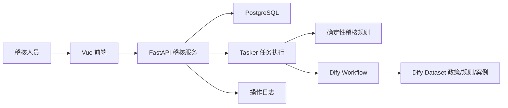

# 交通稽核智能体总体架构设计

一期采用 FastAPI + Dify Workflow + 确定性稽核服务的轻量架构。Yuxi-Know 的用户、任务、日志和前端经验可复用，但不把完整 RAG/知识图谱平台作为交通稽核主链路。

## 架构原则

- 业务流水只进入确定性程序，不进入 RAG、知识图谱或 Dify Dataset。
- 政策制度、规则和案例进入 Dify Dataset，用于文本检索和依据补充。
- Dify Workflow 只生成报告草稿、依据摘要和辅助意见，不自动定案。
- 人工复核是正式结论的唯一出口。
- ColPali 不进入一期主流程，仅保留二期视觉检索 PoC 入口。

## 组件

## 数据流

1. 稽核人员创建案件并上传车辆、交易、通行事件样例。
2. FastAPI 完成字段校验、时间与车牌标准化、重复记录去除。
3. 确定性稽核服务还原路径并执行规则检测。
4. 结果写入案件，生成结构化证据和基础 Markdown 报告。
5. 可选调用 Dify Workflow 生成报告草稿增强版。
6. 管理员人工确认或驳回，写入复核记录和操作日志。

## 部署

一期 Docker Compose 至少包含 `api`、`web`、`postgres`。Dify 可以使用外部部署，也可以在独立 Compose 中部署后通过环境变量接入。

必要环境变量：

- `DIFY_WORKFLOW_API_URL`
- `DIFY_WORKFLOW_API_KEY`
- `DIFY_WORKFLOW_AUDIT_REPORT_DRAFT_ID`
- `DIFY_WORKFLOW_POLICY_BASIS_SUMMARY_ID`
- `DIFY_WORKFLOW_GREEN_VEHICLE_REVIEW_DRAFT_ID`
