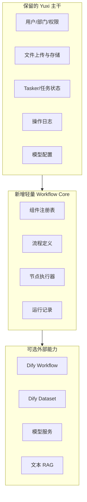

# 轻量组件工作流核心设计

当前交通稽核方向不建议继续依赖完整 Yuxi-Know 平台主链路。更合适的方式是保留 Yuxi 可复用的主干能力，再新增一个轻量 Workflow Core，让用户像 Haystack 一样选择组件、配置参数、连接输入输出，形成简单可审计的业务流程。

## 结论

推荐采用“独立轻量核心 + 可选接入 Yuxi 能力”的路线。

- 保留：用户登录、部门权限、文件上传、任务记录、操作日志、模型配置、基础前端布局。
- 弱化：LightRAG 自动图谱、复杂 Agent 编排、完整知识库平台、Neo4j 强依赖、多 OCR 插件链路。
- 新增：组件注册表、工作流定义、工作流运行记录、节点执行器、可视化编排页面。
- 外接：Dify 可作为报告生成与知识问答编排器，但不作为案件事实系统。

## 和 Yuxi 的关系

这不是在原 Yuxi 上继续堆功能，而是把 Yuxi 拆成“可复用底座”：



## 核心模型

### 组件 Component

组件是最小可复用能力，类似 Haystack 的 component。

```json
{
  "type": "traffic.audit.detect_anomaly",
  "name": "异常检测",
  "category": "traffic_audit",
  "inputs": {
    "events": "array",
    "transactions": "array"
  },
  "outputs": {
    "evidence": "array",
    "risk_summary": "object"
  },
  "config_schema": {
    "enabled_rules": ["missing_entry", "time_conflict", "path_gap", "fee_mismatch"]
  }
}
```

### 工作流 Workflow

工作流只保存组件、参数和连线，不保存自由文本推理结果。

```json
{
  "id": "traffic_audit_basic",
  "name": "交通稽核基础分析",
  "nodes": [
    {
      "id": "parse_files",
      "type": "traffic.audit.parse_files",
      "config": {}
    },
    {
      "id": "restore_route",
      "type": "traffic.audit.restore_route",
      "config": {}
    },
    {
      "id": "detect_anomaly",
      "type": "traffic.audit.detect_anomaly",
      "config": {
        "enabled_rules": ["missing_entry", "time_conflict", "path_gap", "fee_mismatch"]
      }
    },
    {
      "id": "draft_report",
      "type": "dify.workflow.audit_report_draft",
      "config": {
        "workflow_code": "audit_report_draft"
      }
    }
  ],
  "edges": [
    ["parse_files.records", "restore_route.records"],
    ["restore_route.route", "detect_anomaly.route"],
    ["detect_anomaly.evidence", "draft_report.evidence"]
  ]
}
```

### 运行 WorkflowRun

运行记录必须可复盘：

- 输入快照
- 每个节点的开始时间、结束时间、状态
- 每个节点的输出摘要
- 错误信息
- 创建人、部门、案件 ID
- 最终报告草稿或人工复核结论

## 一期组件清单

交通稽核确定性组件：

- `traffic.audit.parse_files`：解析 CSV/XLSX 样例文件。
- `traffic.audit.normalize_records`：标准化车牌、时间、字段名。
- `traffic.audit.dedupe_events`：去重通行事件。
- `traffic.audit.restore_route`：按时间窗还原入口、门架、出口路径。
- `traffic.audit.detect_anomaly`：执行四类规则检测。
- `traffic.audit.build_evidence`：生成证据项和源记录引用。

知识与报告组件：

- `rag.policy.retrieve`：检索政策、制度、规则、案例。
- `dify.workflow.audit_report_draft`：调用 Dify 生成报告草稿。
- `dify.workflow.policy_basis_summary`：调用 Dify 生成依据摘要。
- `report.markdown.render`：渲染 Markdown 报告。

人工节点：

- `human.review.approve`：确认异常。
- `human.review.reject`：驳回结论并填写意见。

## 执行原则

- 确定性组件可以改变结构化案件结果。
- Dify、LLM、RAG 组件只能生成草稿、摘要、建议，不得直接改变正式结论。
- 工作流节点必须声明输入输出，禁止节点直接读取任意全局状态。
- 用户可选择组件，但系统只允许选择白名单组件。
- 一期不做复杂循环、动态分支和多 Agent 自主规划，先支持 DAG。

## 最小 API

```text
GET    /api/workflow/components
POST   /api/workflow/definitions
GET    /api/workflow/definitions
GET    /api/workflow/definitions/{workflow_id}
POST   /api/workflow/definitions/{workflow_id}/run
GET    /api/workflow/runs/{run_id}
POST   /api/workflow/runs/{run_id}/cancel
```

## 最小前端页面

- 组件面板：按“文件处理、交通稽核、知识检索、Dify、报告、人工复核”分类。
- 编排画布：节点拖拽、连线、参数配置。
- 运行详情：展示每个节点状态、输入输出摘要、错误信息。
- 模板库：提供“交通稽核基础分析”“绿通辅助核查”“政策依据问答”三个模板。

## 不做的事

- 不在一期做完整低代码平台。
- 不默认接入 Neo4j 或 LightRAG 自动图谱。
- 不让用户上传任意 Python 代码作为节点。
- 不让 Dify 或 LLM 自动生成正式稽核结论。
- 不把通行流水写入 RAG 或知识图谱。
